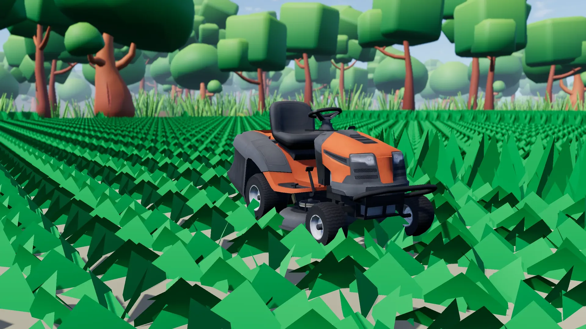
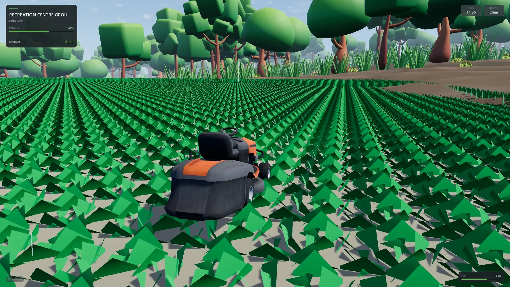
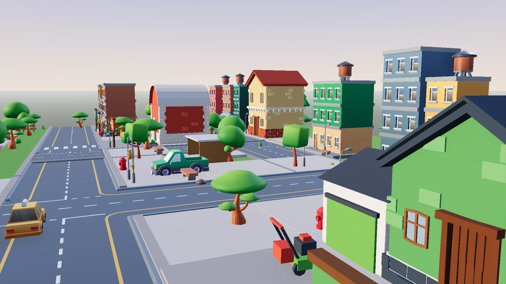
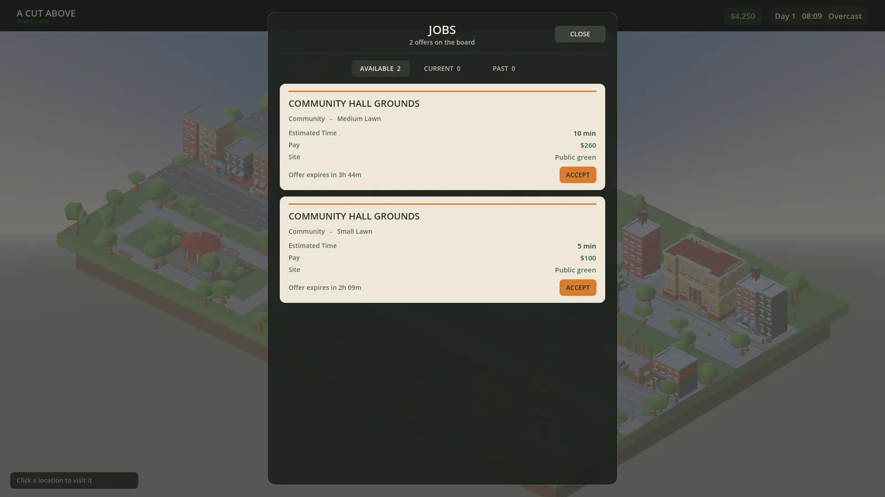
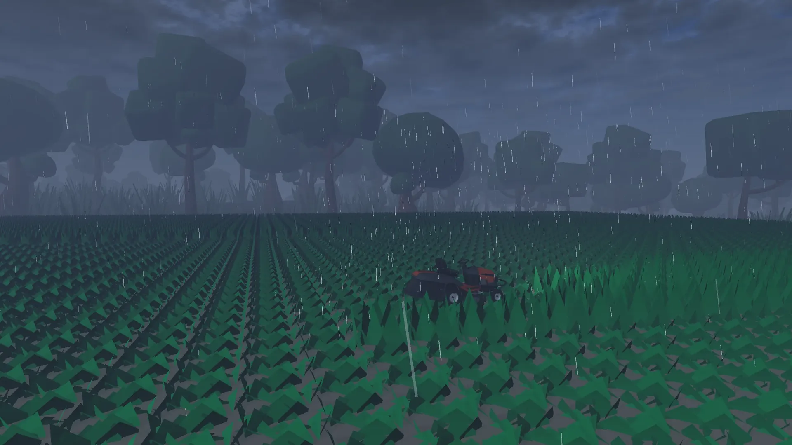

# A Cut Above: Mow & Grow

An independent 3D lawn-mowing and small-business simulation built in Godot. Choose a contract, travel to the property, make a clean cut, get paid, and invest in the next job.

[Project website](https://usw344.github.io/A-Cut-Above-Lawn-Mowing-Startup-public/) · [Wishlist on Steam](https://store.steampowered.com/app/3807260/A_Cut_Above_Mow__Grow/) · [Play on itch.io](https://sologamedev873.itch.io/a-cut-above-mow-and-grow) · [Trailer status](#trailer)

## About

The current build connects the full playable loop from the main menu to town, contract selection, mowing, payment, and return. Jobs vary by property and conditions, while time, weather, fuel, market prices, mower upgrades, and business progress persist between sessions.

## Gameplay loop

1. Choose a lawn-care contract in town.
2. Travel to the property with the right mower.
3. Cut the lawn and track job progress.
4. Complete the contract and collect payment.
5. Refuel, improve equipment, and plan the next job.

## Current features

- A complete menu, town, contract, mowing, payment, and return loop
- Three usable mowers: riding, powered walk-behind, and manual push
- Generated contracts with varied properties and job conditions
- A business town with job, supply, business, and workshop locations
- Fuel use for powered equipment, paid refueling, and a fuel-free manual mower
- Per-mower speed, efficiency, and handling improvements where applicable
- Clear, foggy, and rainy weather alongside a persistent world clock
- A changing economy that affects contract, fuel, and equipment prices
- Save and load support for the world, contracts, money, fuel, upgrades, and active mowing work

## Screenshots

| Mowing a contract | Business town |
| --- | --- |
|  |  |
| Job board | Rainy contract |
|  |  |

## Technical highlights

- Godot 4.6 and GDScript
- Custom chunked MultiMesh grass for large mowable areas
- Contract-sized lawns with live completion tracking
- Deterministic contract generation and day-based market changes
- Central application flow across menu, town, jobs, settlement, and return
- Save support for an in-progress lawn
- Automated validation, screenshot capture, and trailer-capture tools

## Development status

Development is active. The core mowing and business loop is integrated; current work focuses on presentation, balance, content variety, and performance.

## Running the project

Open [`project.godot`](project.godot) with Godot 4.6.x. Public builds are available on [itch.io](https://sologamedev873.itch.io/a-cut-above-mow-and-grow), and the game can be wishlisted on [Steam](https://store.steampowered.com/app/3807260/A_Cut_Above_Mow__Grow/).

## Trailer

The new gameplay trailer is being edited. The project website is ready for its final YouTube link when the upload is published.

## Credits and licensing

Project credits are maintained in the [`Credits`](Credits) directory. Project source is all rights reserved. Third-party components remain subject to their respective licenses.
