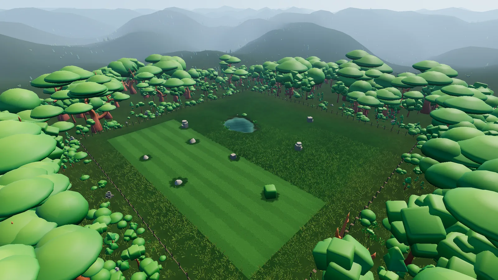
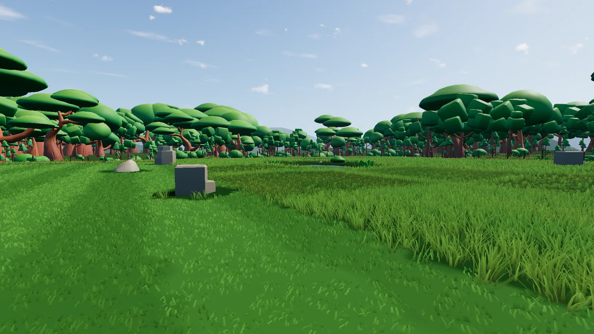
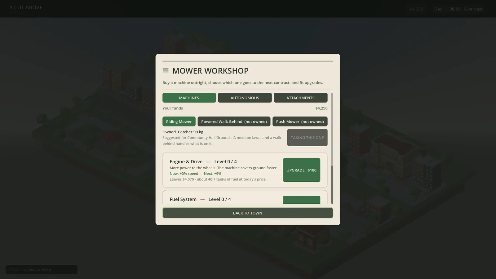

# A Cut Above: Mow & Grow

A 3D lawn-care business simulator built with Godot 4.6.1 and GDScript. It brings together physical mowing, generated properties, persistent lawn state, large-scale grass rendering, business progression, weather, and a full playable loop.

[Portfolio site](https://usw344.github.io/A-Cut-Above-Lawn-Mowing-Startup-public/) · [Gameplay showcase](https://youtu.be/c00JftQTui8) · [Play on itch.io](https://sologamedev873.itch.io/a-cut-above-mow-and-grow) · [Steam](https://store.steampowered.com/app/3807260/A_Cut_Above_Mow__Grow/)

## Project overview

A Cut Above is an independent project. Its gameplay systems, application flow, generated content, simulation state, persistence, UI integration, optimization work, and validation tooling were developed together over time. Credited art, audio, and third-party components are documented in [`Credits`](Credits).

The current build connects the full playable loop:

**Main menu → new game → business town → generated contract → job intro → mowing → settlement → return to town**

World time, weather, contracts, money, equipment, upgrades, business progress, and active lawn work persist between sessions.

## Engineering highlights

### Procedural properties

Each accepted contract produces a property from a seed and a shared set of parameters: lawn dimensions, terrain, boundaries, obstacles, planting beds, ponds, forest density, and surrounding scenery. Those property features also inform mowing completion and the minimap, so the game is not maintaining separate versions of the same space.

### Compact mowing state

The current Lawn 2.0 architecture stores logical one-unit cells in compact byte arrays. A mower deck sweeps geometry across those cells, updating cut state and heading without one physics body per blade of grass. Progress is maintained incrementally, and in-progress work is serialized as a compact bitset plus heading data.

### Grass rendering at property scale

Grass is rendered in cullable near- and mid-field `MultiMeshInstance3D` tiles. A small cut-mask texture keeps the visual grass in sync with the lawn data. The repository also includes property probes, stress tests, performance instrumentation, and focused validation scenes for checking build cost and runtime behavior.

### Application architecture

The project separates routing, time and weather, jobs, economy, equipment, business state, and file I/O into focused systems. UI scenes show the current state and send player actions back to those systems. That supports a complete menu-to-town-to-job-to-settlement flow instead of a single mowing scene.

### Weather and environment

`WorldClock` keeps persistent time and scheduled weather. Project adapters pass that state into the Sky3D environment, precipitation, lighting, and ground-condition presentation, keeping the third-party integration contained.

### Persistence and validation

Save data includes world state, jobs, economy, equipment, upgrades, business history, territories, agreements, portfolio data, and active mowing work. Automated tests and visual probes cover system rules, UI routes, scene composition, persistence, rendering, and performance-sensitive behavior.

## Current systems

- Three controllable mower types with distinct handling and operating tradeoffs
- Generated contracts, expiry, acceptance, active work, settlement, and history
- Business town services for jobs, supplies, equipment, upgrades, and business progression
- Economy, fuel, equipment ownership, attachments, territories, agreements, and reputation
- Persistent world clock, scheduled weather, wet-ground presentation, and environment audio
- Procedural terrain, foliage, boundaries, ponds, obstacles, planting zones, and minimap data
- Production HUD, transitions, notifications, settings, controls help, pause, and completion UI
- Save/load support for meaningful simulation and in-progress lawn state

## Current build

| Generated property and mowing state | Business town |
| --- | --- |
|  |  |
| Contract system | Business progression |
|  |  |

## Technology

- Godot 4.6.1 and GDScript
- Jolt Physics
- Procedural generation and seeded random streams
- Tiled MultiMesh rendering and shaders
- JSON-based persistence with additive save sections
- Git and GitHub Pages
- Automated test scenes, probes, profiling, and screenshot tooling

## Running the project

1. Open [`project.godot`](project.godot) in Godot 4.6.1 or a compatible Godot 4.6.x build.
2. Run the configured main scene: `res://Game/App/Main Menu Screen.tscn`.

The repository also contains focused validation scenes under [`Dev tools/Validation`](Dev%20tools/Validation) and deeper architecture documentation in [`project-docs`](project-docs).

## Development status

Development is active. The connected gameplay and business loop is working, with current work focused on presentation, balance, content breadth, validation, and performance. The linked video is the older v0.3 gameplay showcase; the screenshots and repository reflect the newer build.

## Licensing

Project source is all rights reserved. Third-party assets and components remain subject to their respective licenses; see [`Credits`](Credits).
