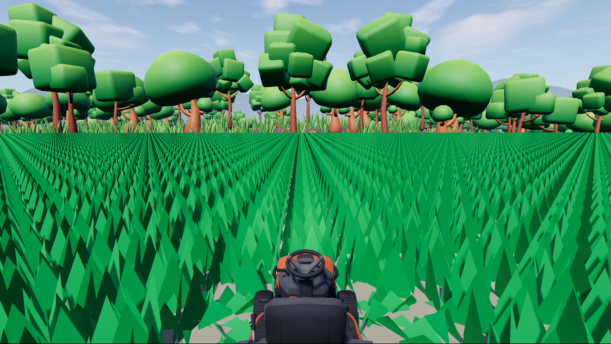
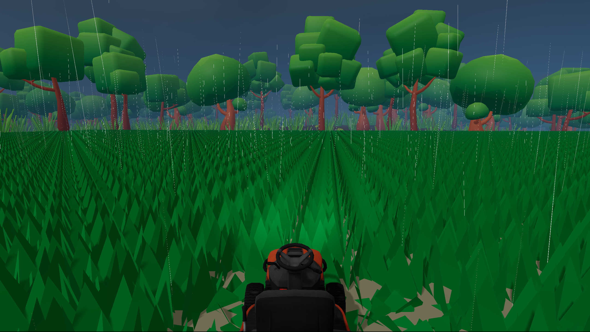
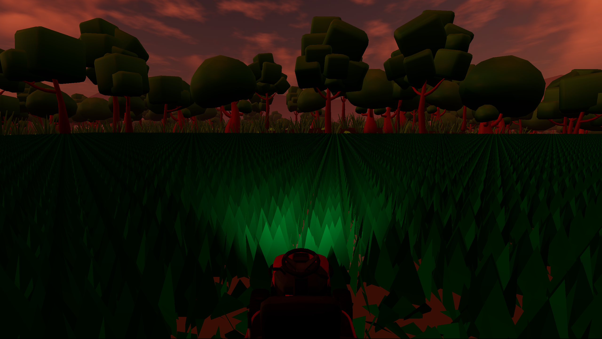

# A Cut Above: Mow & Grow

A 3D lawn care business simulator built in Godot.

## Live Project Page
[View the project page](https://usw344.github.io/A-Cut-Above-Lawn-Mowing-Startup-public/)

## Trailer
[Watch the gameplay video on YouTube](https://www.youtube.com/watch?v=21TJlZmOSXo)

## Steam
[Wishlist on Steam](https://store.steampowered.com/app/3807260/A_Cut_Above_Mow__Grow)

## About
This project began as a small 2D experiment in 2022 and later evolved into a 3D game focused on mowing, atmosphere, and long-term business simulation systems. It has been a major personal project for learning programming, 3D workflows, sound integration, and game architecture in Godot.

## Current Focus
- First-person mowing gameplay
- Atmosphere and environmental presentation
- Weather and sound
- Progression toward a fuller lawn care business simulator

## Screenshots

## Roadmap
### Version 0.3
- equipment purchases and upgrades
- more mower variety
- progression tied to business growth
- early economic loop

### Version 0.4
- main menu
- save/load systems
- job generation
- storefront/business hub

### Version 0.5+
- HUD polish
- better UX
- economy balancing
- employee systems
