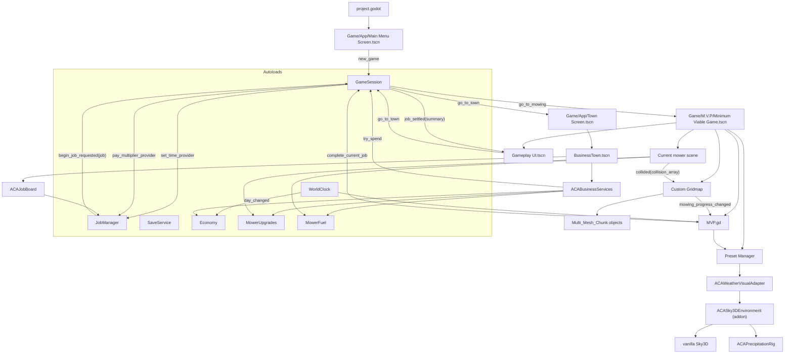

# Architecture and System Relationships

Status: **Current** — source-verified 2026-08-20 (session 7).
Entry point: `res://Game/App/Main Menu Screen.tscn`

## Layering

The application is three layers. Keep them separate.

```
APPLICATION   GameSession  WorldClock  SaveService  AppUI  GameSettings
              Economy  MowerUpgrades  MowerFuel                (autoloads)
              owns: routing, session state, time and weather STATE, the market,
                    file I/O, and THE completion pathway

DOMAIN        JobManager (ACAJobManager)     Custom_Gridmap + Multi_Mesh_Chunk
              model (legacy shared state)    preset_manager -> environment
              owns: game state. Never changes scenes. Never touches UI.

PRESENTATION  res://UI/**   ACAJobBoard   ACABusinessHUD   ACABusinessServices
              displays state, emits intent. Owns no game state.
```

Integration between layers lives in exactly three host scripts:
`Game/App/main_menu_screen.gd`, `Game/App/town_screen.gd`,
`Game/App/gameplay_ui.gd`.

## Autoloads

Registered in `project.godot`, in load order.

| Autoload | Script | Owns |
|---|---|---|
| `model` | `Data Structures/Model.gd` | LEGACY shared state: mower speed, fuel level, blade length |
| `MowerFuel` | `Game/App/mower_fuel.gd` | Fuel RULES. Storage stays on `model` |
| `WorldClock` | `Game/World/world_clock.gd` | Authoritative game time, season, weather STATE |
| `JobManager` | `Main Area/ACA_JobSystem/.../job_manager.gd` | Job domain state, offers, expiry, history |
| `GameSettings` | `Game/App/game_settings.gd` | Player settings and their application |
| `AppUI` | `Game/App/app_ui.gd` | Transitions, notifications, cursor ownership |
| `GameSession` | `Game/App/game_session.gd` | Routing, session state, **the one money balance**, completion |
| `SaveService` | `Game/App/save_service.gd` | File I/O. Owns no domain state |
| `Economy` | `Game/Economy/economy_manager.gd` | Market conditions, events, prices |
| `MowerUpgrades` | `Game/Economy/mower_upgrades.gd` | Per-mower upgrade levels and their effects |

## Runtime composition



## The boundaries that must not be crossed

1. **`ACAJobManager` never changes scenes.** `begin_new_job()` validates, marks
   the job `IN_PROGRESS`, emits `begin_job_requested(job)` and stops.
   `GameSession` does the transition.
2. **There is one completion pathway.** Real 100% mowing and the development
   fast-completion helper both reach `GameSession.complete_current_job()`.
3. **There is one money balance.** `GameSession` holds it. `Economy` and
   `MowerUpgrades` PRICE things; neither keeps a wallet. Every payment goes
   through `GameSession.try_spend()`, which cannot go negative.
4. **The Job System does not know the economy exists.** The application layer
   injects `pay_multiplier_provider`, exactly as it injects the time provider.
5. **`res://addons/sky_3d/` is read-only.** The environment package reads and
   writes its public properties and modifies nothing inside it.

## Ownership

### Mowing scene root (`MVP.gd`)

Cross-system orchestration: grid creation, mower placement and switching, grid
reset, ambient audio startup, time and weather requests, and telling the weather
system where the camera and the ground are. It does not own grass behaviour,
mower movement or the sky.

### Global model

`model` is LEGACY shared mutable state — mower speed, fuel level, blade length,
position. New systems do not add to it. `MowerFuel` owns the fuel RULES while
`model` merely stores the level, which is why a save restore or a test writing
`model.set_mower_fuel()` is seen immediately.

### Mower scenes

`Assets/Vehicles and Mowers/Mowers/` — the three canonical machines. Each owns
its motion, look, gravity, audio and collision emission, declares `POWERED` and
a stable `MOWER_ID`, and multiplies its authored values by
`MowerUpgrades.*_multiplier(MOWER_ID)`. The authored base is never overwritten.

### Custom grid

The mowable area: dimensions, chunk partitioning, per-chunk grass state,
collision-name decoding, and the conversion from unmowed to mowed grass.
`mow_swath()` / `mow_disc()` exist for media tooling and are not called by
gameplay.

### Economy and upgrades

See [Jobs and Economy](systems/jobs-and-economy.md). The market moves on
`WorldClock.day_changed` and at no other time.

### Weather and environment

See [Weather, Time of Day, and Audio](systems/weather-time-and-audio.md).
`preset_manager` remains the project-facing API; the LOOK is composed by a
reusable addon.

## Canonical and superseded implementations

| Domain | Canonical | Superseded / legacy |
|---|---|---|
| Runtime world | `Minimum Viable Game.tscn` | `Main.tscn` |
| Mowers | `Assets/Vehicles and Mowers/Mowers/` | `Mower Scenes/`, `Mowing Section/Mower/` |
| Terrain | Custom Terrain Manager | Terrain3D experiment (removed) |
| Weather look | `addons/aca_sky3d_environment/` | in-adapter tables (session 7) |
| Rain particles | `ACAPrecipitationRig` (code-built) | authored `rain_particles.tscn` (removed) |
| Precipitation resources | — | `Weather/precipitation/*.tres`, **dead** |
| Sky | Sky3D | historical GodotSky plugin |
| Ponds | `Mowing Section/Experimental/Pond/` — **EXPERIMENTAL** | — |

`Weather/precipitation/*.tres` reference `res://addons/GodotWeatherSystem/`,
which is not installed. Nothing loads them. See
[Legacy and Experimental](legacy-and-experimental.md).

## What is NOT built

Stated plainly so it is not mistaken for an omission:

- **Mower ownership / a dealership.** All three mowers are available; upgrades
  are per machine. There is no purchase-a-mower flow.
- **A fuel inventory.** Fuel is bought into the tank, not into cans.
- **Rocks, props, or pond integration.** The pond tool exists and is tested; the
  grid does not use it.
- **Water volumes.** Pond collision is static bed geometry. Nothing floats.
- **Snow.** `Weather/precipitation/snow*.tres` are dead files, not a feature.
