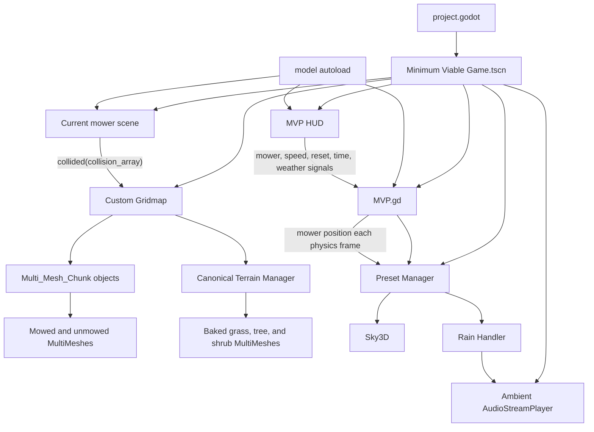
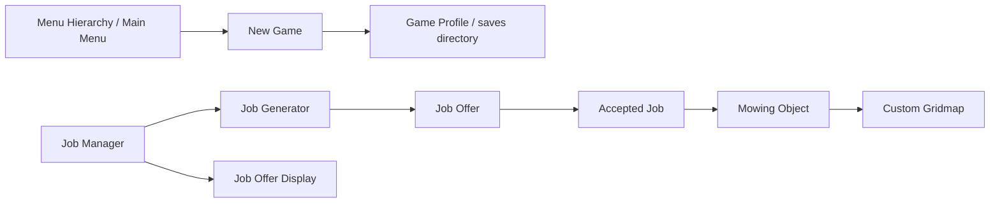

# Architecture and System Relationships

Status: Current playable architecture with partial-system boundaries

## Runtime composition

The authoritative runtime is composed by `Minimum Viable Game.tscn`.

## Ownership

### MVP root

`MVP.gd` owns cross-system runtime orchestration:

- Initial grid creation.
- Initial mower placement.
- Current mower node reference.
- Mower switching.
- Grid reset.
- Ambient audio startup.
- Time and weather requests.
- Passing mower position to weather.

It does not own the detailed behavior of grass, mower movement, or Sky3D.

### Global model

The `model` autoload owns process-lifetime shared state:

- Mower speed and fuel.
- Mower position.
- Blade length and cuttings fields.
- Existing job-offer dictionary.
- Older mower-selection metadata.

The model is a shared mutable state object. Current scripts access it directly rather than through signals or injected references.

### Mower scenes

The canonical mower scenes own:

- Character-body motion.
- Mouse-driven orientation and camera movement.
- Gravity.
- Fuel consumption.
- Mower-specific audio.
- Collision collection and emission.

The rider mower additionally delegates wheel, steering, and engine visual animation to `Rider Mower (In Parts).tscn`.

### Custom grid

The custom grid owns the mowable area:

- Grid dimensions.
- Chunk partitioning.
- Chunk-to-coordinate lookup.
- Mower start position.
- Per-chunk grass state.
- Collision-name decoding.
- Conversion from unmowed to mowed grass.
- Serializable grid and chunk dictionaries.

### Canonical terrain manager

The custom Terrain Manager owns non-mowable environmental presentation:

- Main terrain mesh and colour map.
- Baked tree, shrub, and decorative grass MultiMeshes.
- High/low foliage variants.
- Ring-based density and grass LOD generation tools.
- Mesh sampling for foliage placement.
- Far-grass overlay generation.

It is separate from the mowable grass grid even though both are children of the same custom-grid scene.

### Weather and time

The Preset Manager owns preset selection and Sky3D property transitions. The Rain Handler owns rain particles, rain audio, ambience ducking, and following the mower.

### HUD

The MVP HUD owns controls and diagnostic presentation. It emits domain requests to the MVP root rather than modifying the grid or weather scenes directly. It reads initial speed directly from `model`.

## Communication patterns

### Signals

Confirmed active signal boundaries:

- Mower `collided` → custom-grid collision handler.
- MVP HUD controls → MVP root methods.

The job prototype also uses signals extensively, but that graph is not instantiated by the current runtime.

### Direct references

Confirmed active direct references:

- MVP root → mower, grid, HUD, Preset Manager, ambient audio.
- Mower scripts → `model`.
- Custom grid → its `Mowing Area`, `Start Area`, and Terrain Manager children.
- Preset Manager → Sky3D, Skydome, TimeOfDay, and Rain Handler.
- Rain Handler → particle and audio children.

### Class-name dependencies

Important global GDScript class names include:

- `Custom_Gridmap`
- `Multi_Mesh_Chunk`
- `preset_manager`
- `Rain_Handler`
- Job-related prototype classes

`Custom_Gridmap` constructs `Multi_Mesh_Chunk` objects directly with `Multi_Mesh_Chunk.new()`, so the chunk script is an active dependency even though its `.tscn` wrapper is not instantiated.

## Partially integrated architecture

The repository contains a second, incomplete application layer:

This expresses a plausible intended direction, but several arrows are not implemented in runtime code:

- Menu signals are not wired into navigation.
- New Game does not serialize a profile or change scenes.
- Accept Job is not wired from the display.
- `Job_Offer.accept_job()` returns an empty `Job`.
- `Mowing Object` does not construct or save a complete job.
- The current MVP does not load from a job or profile.

These systems are documented as partially integrated rather than active or hypothetical.

## Canonical and superseded implementations

| Domain | Canonical | Superseded/deprecated |
|---|---|---|
| Runtime world | `Minimum Viable Game.tscn` | `Main.tscn` |
| Mowers | `Assets/Vehicles and Mowers/Mowers/` | `Mower_Normal` and old model scene lookup |
| Terrain | Custom Terrain Manager | Terrain3D experiment |
| Weather | Preset Manager and Rain Handler | GodotWeatherSystem precipitation resources |
| Sky | Sky3D | Historical GodotSky plugin |

Superseded files remain repository cleanup debt and must not be removed solely from this documentation classification.
