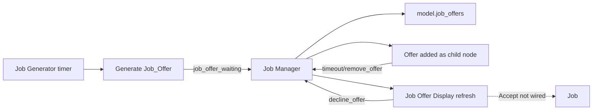

# Jobs and Economy

Status: Existing but partially integrated

## Scope

The repository contains an implemented job-offer prototype with timers, random generation, display state, decline/timeout behavior, and base-pay calculation.

It is not instantiated by the current MVP, and accepting an offer does not yet configure or load gameplay.

## Components

| Component | Script/scene | Responsibility |
|---|---|---|
| Job Manager | `Managers/Job manager/job_manager.gd/.tscn` | Owns generator, active offer nodes, and display lifecycle |
| Job Generator | `Job Generator/Job Generator.gd/.tscn` | Creates timed random offers |
| Job Offer | `Job Offer/Job Offer.gd` | Offer data and acceptance timeout |
| Job Offer Display | `Job Display/Job_offer_display.gd/.tscn` | Presents and browses available offers |
| Job | `Job/job.gd` | Intended accepted-offer subclass |
| Job Type | `Data Structures/Job_Type.gd` | Difficulty and size categories |
| Job Data Container | `Data Structures/Job Data Structure/Job_Data.gd` | Proposed generated-level/save data |
| Global offer registry | `Data Structures/Model.gd` | Shared offer dictionary |

## Intended offer lifecycle

## Job Manager

The manager scene contains:

- Empty CanvasLayer for the dynamically created offer display.
- Debug CanvasLayer and label.
- Instanced Job Generator.

On `_ready()`, it:

- Caches the Job Generator.
- Creates and shows a Job Offer Display.

When a new offer arrives, it:

1. Adds it to `model`.
2. Adds the offer node as a manager child so its Timer can run.
3. Connects its `remove_offer` signal.
4. Updates or recreates the display in an empty-list edge case.

Timeout removes the offer from `model`, refreshes the display, and detaches the offer node.

## Job Generator

The generator:

- Starts with a random short delay.
- Generates offers until the configured maximum active count.
- Adjusts subsequent wait time using current offer count.
- Emits offers to the manager rather than adding them directly to the model.

Generated offer fields:

- Unique random integer ID.
- Difficulty category.
- Size category.
- Square grid size aligned to multiples of 16.
- Completion-time dictionary.
- Base pay.
- Display name.
- Acceptance timeout.

The current probability and balancing constants are prototype values and should not be treated as final economy design.

## Job Offer

A Job Offer stores:

- `job_id`
- `job_size`
- `time_limit`
- `base_pay`
- `display_name`
- `time_to_accept`

When added to the scene tree, it creates a Timer and starts the acceptance countdown.

It can report:

- Offer data as a debug string.
- Remaining time percentage.
- Remaining seconds.

`accept_job()` currently returns a new empty `Job`. It does not copy offer fields or notify the manager.

## Job Offer Display

The display maintains its own ordered dictionary keyed by job ID.

It:

- Synchronizes from `model.get_all_job_offers()`.
- Removes expired offers.
- Adds new offers.
- Tracks the focused offer.
- Refreshes labels and timeout progress every frame.
- Wraps left/right navigation.
- Declines the current offer.
- Emits a close request.

The Accept button exists but has no scene signal connection.

## Accepted Job

`Job` extends `Job_Offer` but currently overrides `_ready()` with an empty method. It has no accepted-job state, progression, completion, reward, or serialization behavior.

## Job Data Container

`Job_Data_Container` is a separate proposed representation for generated mowing-space data:

- Width and length.
- Grass size and scale.
- Job ID.
- Grass data dictionary.
- Other-object data dictionary.
- House type and variant.
- House scale.
- Initialization flags.

Its save dictionary currently includes ID, dimensions, grass data, and other-object data. It does not include every field present on the object.

## Economy state

Existing economy foundations:

- Job base-pay calculation.
- Pay shown in the offer display.
- Empty `model.get_game_money()` interface.
- Money button in the Information Bar.
- Model fields such as mower speed/blade length that can support upgrade effects.
- Canonical mower variants that can become owned/selectable equipment.

Not yet implemented:

- Player balance.
- Reward settlement.
- Purchases.
- Store inventory.
- Upgrade definitions.
- Equipment ownership.
- Economy save schema.
- Job completion/penalties.
- Balancing rules.

The economy and upgrade direction is therefore partially integrated at the data/interface foundation level, not a complete runtime loop.

## Missing integration

The current application still needs a defined path for:

1. Making the Job Manager part of the application scene tree.
2. Accepting an offer.
3. Copying offer data into an accepted Job.
4. Creating or loading job terrain/mowing state.
5. Transitioning from selection to gameplay.
6. Tracking completion.
7. Awarding pay.
8. Updating persistent economy and equipment.
9. Returning to a business/menu context.

These are integration and design tasks; they do not require replacing the existing architecture wholesale.
